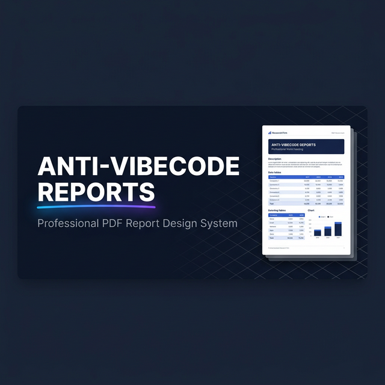
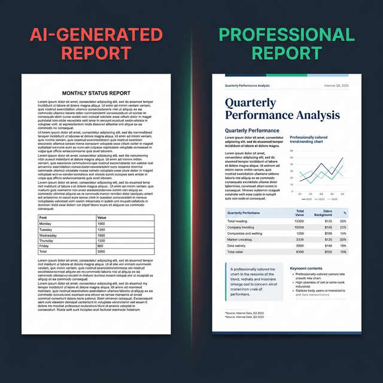
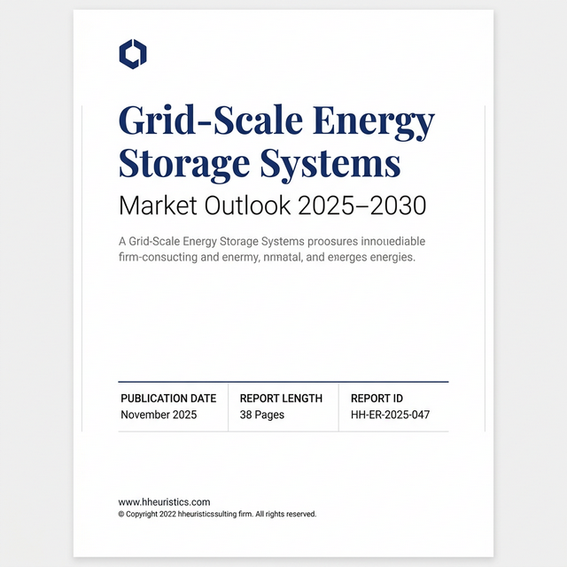
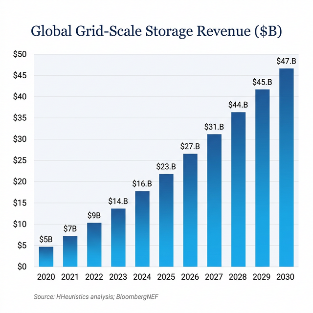
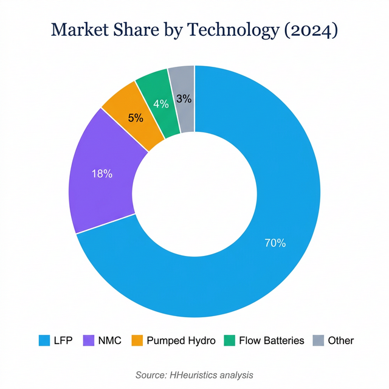

<p align="center">
  
</p>

<h1 align="center">📄 Anti-Vibecode Reports</h1>

<p align="center">
  <strong>Stop generating reports that look like ChatGPT pasted into Google Docs.</strong><br/>
  A complete design system + AI prompt for producing boutique-quality market research PDFs<br/>
  using <strong>Google Antigravity</strong> for custom graphics and charts.
</p>

<p align="center">
  <a href="#-how-it-works-google-antigravity">🚀 How It Works</a> •
  <a href="#-the-full-prompt-copy-this">🤖 Copy the Prompt</a> •
  <a href="#-example-report">📊 Example Report</a> •
  <a href="#-report-archive">📁 Archive</a> •
  <a href="https://hheuristics.com">🏠 HHeuristics</a>
</p>

<p align="center">
  
  
  
  
</p>

---

## 🤔 The Problem

Every AI can _write_ a report. Almost none of them can **format** one.

<p align="center">
  
</p>

> **Left**: AI default — walls of text, system fonts, unstyled tables. **Right**: What this prompt produces — serif headings, zebra-striped tables, custom charts, callout boxes, source citations.

---

## 🚀 How It Works (Google Antigravity)

This repo is designed to work with **Google Antigravity** (or any AI agent with image generation). Here's the workflow:

### Step 1: Give Antigravity the Prompt

Copy the [full prompt](#-the-full-prompt-copy-this) below and paste it into your Google Antigravity conversation. Tell it what report you want to create.

### Step 2: Antigravity Generates Custom Graphics

Antigravity uses its **image generation tool** (internally called "nano banana") to create:

- 📄 **Custom cover pages** with your report title and branding
- 📊 **Professional charts** (bar charts, pie charts, line charts) with your real data
- 🏷️ **Section headers** with numbered dividers
- 📐 **Infographic elements** for key metrics

### Step 3: Antigravity Assembles the PDF

Using Python + reportlab (or similar), Antigravity builds the final PDF:

- Lays out the text with proper fonts and hierarchy
- Inserts the custom-generated charts and graphics
- Applies zebra-striped tables, callout boxes, and the full design system
- Exports a polished, print-ready PDF

### Why This Is Smart

| Approach               | Graphics Quality | Data Accuracy | Scalability       |
| ---------------------- | ---------------- | ------------- | ----------------- |
| Pure text (ChatGPT)    | ❌ None          | ✅ Good       | ✅ Easy           |
| Pure code (reportlab)  | ⚠️ Basic         | ✅ Good       | ✅ Repeatable     |
| **Hybrid (this repo)** | **✅ Stunning**  | **✅ Good**   | **✅ Repeatable** |

> **Image gen for the "wow" elements** (cover, charts, infographics) + **code for structured content** (text, tables, callouts) = best of both worlds.

---

## 📊 Example Report

### Grid-Scale Energy Storage Systems — Market Outlook 2025–2030

**[📥 View the Reformatted PDF](https://github.com/Nhughes09/pdfreportformat/blob/main/reports/2025-11_grid-scale-energy-storage/Grid_Scale_Energy_Storage_REFORMATTED.pdf)** · [⬇️ Direct Download](https://raw.githubusercontent.com/Nhughes09/pdfreportformat/main/reports/2025-11_grid-scale-energy-storage/Grid_Scale_Energy_Storage_REFORMATTED.pdf) · [📄 Original PDF](https://github.com/Nhughes09/pdfreportformat/blob/main/reports/2025-11_grid-scale-energy-storage/Grid_Scale_Energy_Storage_Report_2025.pdf)

Generated assets for this report:

<p align="center">
  
  
  
</p>

> All graphics generated by Google Antigravity's image generation tool using the prompts in this design system.

---

## 📁 Report Archive

All reports and their prompt versions are tracked here. Each folder contains the final PDF + generated graphics.

| Date    | Report                                                                  | PDF                                                                                                                                                                                                                                                                                                                   | Pages | Prompt                             | Graphics         |
| ------- | ----------------------------------------------------------------------- | --------------------------------------------------------------------------------------------------------------------------------------------------------------------------------------------------------------------------------------------------------------------------------------------------------------------- | ----- | ---------------------------------- | ---------------- |
| 2025-11 | [Grid-Scale Energy Storage](reports/2025-11_grid-scale-energy-storage/) | [📄 Reformatted](https://github.com/Nhughes09/pdfreportformat/blob/main/reports/2025-11_grid-scale-energy-storage/Grid_Scale_Energy_Storage_REFORMATTED.pdf) · [Original](https://github.com/Nhughes09/pdfreportformat/blob/main/reports/2025-11_grid-scale-energy-storage/Grid_Scale_Energy_Storage_Report_2025.pdf) | 38    | [v1.0](prompts/v1.0_2025-11-04.md) | Cover + 2 charts |

### Adding a New Report

```
reports/
├── 2025-11_grid-scale-energy-storage/    ← folder per report
│   ├── Grid_Scale_Energy_Storage.pdf     ← final PDF
│   ├── cover.png                         ← generated cover page
│   ├── chart_revenue.png                 ← generated chart
│   └── chart_technology.png              ← generated chart
├── 2025-12_next-report-topic/            ← add new folders here
│   ├── ...
```

### Prompt Versioning

```
prompts/
├── v1.0_2025-11-04.md     ← founding version + lessons learned
├── v1.1_YYYY-MM-DD.md     ← improvements from next report
├── v2.0_YYYY-MM-DD.md     ← major revision
```

Each prompt version documents: what changed, what report it was used for, what worked, what to improve.

---

## 🤖 The Full Prompt (Copy This)

> **Paste this into Google Antigravity** (or Claude, Cursor, GPT) before asking for a report. It transforms AI output from generic to publication-quality.

```
You are generating a professional market research report in the style of a boutique consulting firm (HHeuristics). Follow these formatting and design rules strictly. The report must NOT look AI-generated.

You have access to an IMAGE GENERATION tool. Use it to create:
- A custom COVER PAGE image with the report title, subtitle, metadata block
- CHARTS (bar, line, pie/donut) with real data from the report, using the color palette below
- SECTION HEADER images with numbered dividers for each major section

## DOCUMENT STRUCTURE (Mandatory)

1. Cover Page — generated image with title, subtitle, pub date, pages, report ID
2. Table of Contents — section titles + page numbers
3. Executive Summary — ≤2 pages, 3–5 bullets with BOLD lead-ins + specific numbers
4. Analysis Sections (3–6) — data tables, charts, callout boxes
5. Strategic Recommendations — by stakeholder type, priority rankings
6. Methodology & Sources — primary research, data sources
7. Disclaimer & About — legal, firm contact info

## TYPOGRAPHY

Two fonts only:
- HEADINGS: Playfair Display (serif) — or DM Serif Display, Lora
- BODY: Inter (sans-serif) — or DM Sans, Source Sans 3

Scale:
- Report title: 28–36pt, serif, bold, navy (#1e3a8a)
- Section heading: 18–22pt, serif, bold, navy
- Subsection: 14–16pt, serif, semibold, slate (#334155)
- Body: 10–11pt, sans-serif, slate-700, line-height 1.6–1.7
- Table text: 9–10pt
- Exhibit labels: 9pt, bold, UPPERCASE, sky-600, wide tracking
- Page numbers: 9pt, slate-400

## COLOR PALETTE

Primary Navy:      #1e3a8a  (headings)
Dark Slate:        #334155  (body text)
Accent Sky:        #0ea5e9  (highlights, key figures, chart color 1)
Accent Violet:     #8b5cf6  (chart color 2)
Accent Emerald:    #10b981  (positive values, chart color 3)
Accent Amber:      #f59e0b  (caution, chart color 4)
Accent Rose:       #f43f5e  (negative values, chart color 5)
Background Alt:    #f8fafc  (zebra rows)
Border:            #e2e8f0  (table lines)

## IMAGE GENERATION PROMPTS

For COVER PAGE, generate:
"Professional report cover page, portrait, white background. Navy serif title: [TITLE]. Subtitle: [SUBTITLE]. Metadata block: PUBLICATION DATE / REPORT LENGTH / REPORT ID. Logo at top, hheuristics.com at bottom. Clean, minimal, consulting firm aesthetic."

For BAR CHARTS, generate:
"Clean bar chart, white background. Title in navy serif: [TITLE]. Bars in sky blue (#0ea5e9) gradient. Data labels above bars. Light gray horizontal grid lines only. Source line in italic gray below. No borders, no 3D effects."

For PIE/DONUT CHARTS, generate:
"Professional donut chart, white background. Title in navy serif: [TITLE]. Segments: [DATA]. Colors: sky, violet, emerald, amber, gray. Percentage labels. Legend below. Source line in italic gray."

For SECTION HEADERS, generate:
"Section title page for PDF report. White background. Large sky blue number '[N].' at top. Navy serif heading: [TITLE]. Thin gray line below. Brief description in gray sans-serif."

## TABLE FORMATTING

- Label: "Exhibit N: Title" above every table
- Header: bg #f8fafc, navy text, bold, UPPERCASE, 9pt, 2px bottom border
- Rows: alternating white / #f8fafc (zebra)
- Numbers: right-aligned
- Total row: bg #f0f9ff, navy text, bold, 2px top border
- Source line: italic 8pt below every table
- NO vertical borders, only light horizontal lines (#e2e8f0)

## CALLOUT BOXES

KEY FINDING: left border 3px #0ea5e9, bg #f0f9ff
TECHNOLOGY OUTLOOK: left border 3px #8b5cf6, bg #faf5ff
FORECAST SCENARIOS: border 1px #e2e8f0, bg #f8fafc, colored bullet dots

## EXECUTIVE SUMMARY

- Open with declarative finding, NOT "This report examines..."
- 3–5 bullets with BOLD lead-in: "**Market Growth**: The global..."
- Every bullet has a specific number
- End with strategic implications

## WRITING STYLE

- Em-dashes (—) for parenthetical
- En-dashes (–) for ranges: "2025–2030", "$80–100/kWh"
- Use "Exhibit" not "Table" or "Figure"
- Define acronyms on first use
- Oxford comma
- Action-oriented: "We recommend" not "It could be considered"

## CHECKLIST

□ Cover page image generated with title + metadata
□ Charts generated with real data + correct colors
□ All headings serif, navy (#1e3a8a)
□ Body 10–11pt sans-serif, line-height 1.6+
□ Tables zebra-striped with "Exhibit N" labels
□ Callout boxes for key findings
□ Source citations on all exhibits
□ Em/en-dashes correct
□ No emoji, no casual tone
□ Methodology + disclaimer included
```

---

## 🎨 Design System Quick Reference

### Fonts

| Role          | Font             | Size    | Color                  |
| ------------- | ---------------- | ------- | ---------------------- |
| Report Title  | Playfair Display | 28–36pt | Navy #1e3a8a           |
| Section Head  | Playfair Display | 18–22pt | Navy #1e3a8a           |
| Body Text     | Inter            | 10–11pt | Slate #334155          |
| Table Header  | Inter Bold       | 9pt     | Navy, UPPERCASE        |
| Exhibit Label | Inter Bold       | 9pt     | Sky #0ea5e9, UPPERCASE |

### Color Palette

```
Navy      #1e3a8a  ████  Headings
Slate     #334155  ████  Body text
Sky       #0ea5e9  ████  Highlights, Chart 1
Violet    #8b5cf6  ████  Accents, Chart 2
Emerald   #10b981  ████  Growth, Chart 3
Amber     #f59e0b  ████  Caution, Chart 4
Rose      #f43f5e  ████  Risk, Chart 5
```

### Chart Color Sequence

`Sky → Violet → Emerald → Amber → Rose → Slate`

### Table Style

Zebra-striped • Navy uppercase headers • No vertical borders • Source citations • "Exhibit N" labels

---

## 🚫 AI Report vs Professional Report

| AI-Generated ❌           | Professional ✅                                    |
| ------------------------- | -------------------------------------------------- |
| Default system fonts      | Playfair Display + Inter                           |
| "This report examines..." | Bold declarative findings                          |
| Unstyled plain tables     | Zebra-striped, navy headers                        |
| No charts or images       | Custom-generated charts + cover                    |
| Walls of unbroken text    | 4–6 sentence paragraphs, callout boxes             |
| "significant growth"      | "$47.2 billion by 2030, 20.1% CAGR"                |
| Random colors             | Navy/Sky/Violet/Emerald palette                    |
| No exhibit labels         | "Exhibit 4: Battery Technology Matrix"             |
| Missing sources           | "Source: BloombergNEF; HHeuristics"                |
| No structure              | TOC → Exec Summary → Analysis → Recs → Methodology |

---

## 📂 Repo Structure

```
pdfreportformat/
├── README.md                          ← You are here (prompt + guide)
├── assets/                            ← README images
│   ├── banner.png
│   ├── comparison.png
│   └── elements.png
├── reports/                           ← Report archive (PDFs + graphics)
│   ├── README.md                      ← Index of all reports
│   └── 2025-11_grid-scale-energy-storage/
│       ├── Grid_Scale_Energy_Storage_Report_2025.pdf
│       ├── cover.png                  ← Generated cover page
│       ├── chart_revenue.png          ← Generated chart
│       └── chart_technology.png       ← Generated chart
├── prompts/                           ← Prompt version history
│   └── v1.0_2025-11-04.md            ← Version log + lessons learned
├── templates/                         ← Reusable visual templates
│   ├── README.md                      ← How to use templates
│   ├── cover_page.png                 ← Generic cover template
│   └── section_header.png            ← Generic section header
└── scripts/                           ← PDF generation tools (future)
```

---

## 🔗 Related

- **[Anti-Vibecode (Web)](https://github.com/Nhughes09/reactcomponentshheuristics)** — 11 premium React components + web design system
- **[HHeuristics](https://hheuristics.com)** — Where these reports are published

---

<p align="center">
  <strong>Built by <a href="https://github.com/Nhughes09">@Nhughes09</a> for <a href="https://hheuristics.com">HHeuristics</a></strong><br/>
  <sub>MIT License — Powered by Google Antigravity 🚀</sub>
</p>
