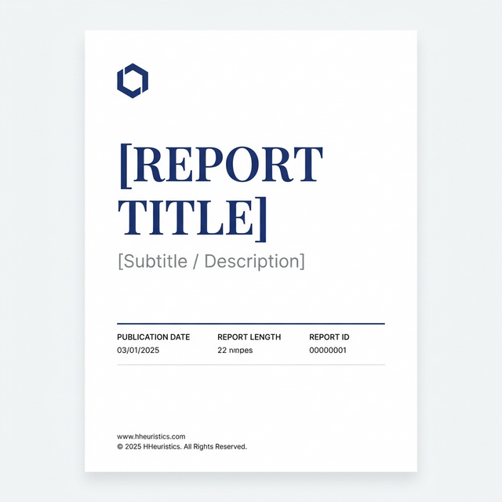
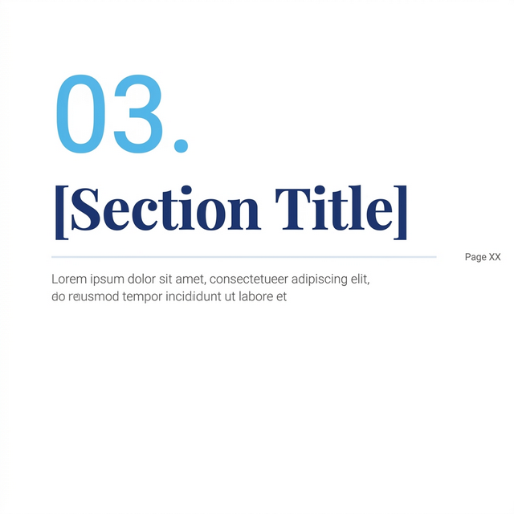

# Templates

Reusable visual assets for report generation. These are generated with AI image tools and can be used as backgrounds or overlaid with text.

## Available Templates

| Template       | Preview                       | Usage                                                 |
| -------------- | ----------------------------- | ----------------------------------------------------- |
| Cover Page     |       | Full-page cover with title, subtitle, metadata block  |
| Section Header |  | Section title pages with number, heading, description |

## How to Use

### Approach 1: Image Overlay (Quick)

Generate the template image, then overlay your specific text using:

- Python (Pillow/PIL) — `ImageDraw.text()` on top of template
- reportlab — draw image as background, render text on top

### Approach 2: Code Generation (Scalable)

Use the color palette and typography specs from the main prompt to programmatically create these elements. See `scripts/` for Python examples.

### Approach 3: Hybrid (Recommended)

- Use image gen for **cover pages** and **decorative elements** (unique per report)
- Use code for **tables, callout boxes, body text** (consistent, data-driven)
- Combine with reportlab's `canvas.drawImage()` + text rendering

## Generating New Templates

Ask your AI image generator:

```
Generate a [element type] for a professional PDF report.
White background. Navy (#1e3a8a) headings in serif font.
Sky blue (#0ea5e9) accents. Clean, minimal, consulting firm aesthetic.
No stock photos, no gradients — pure typography design.
```
